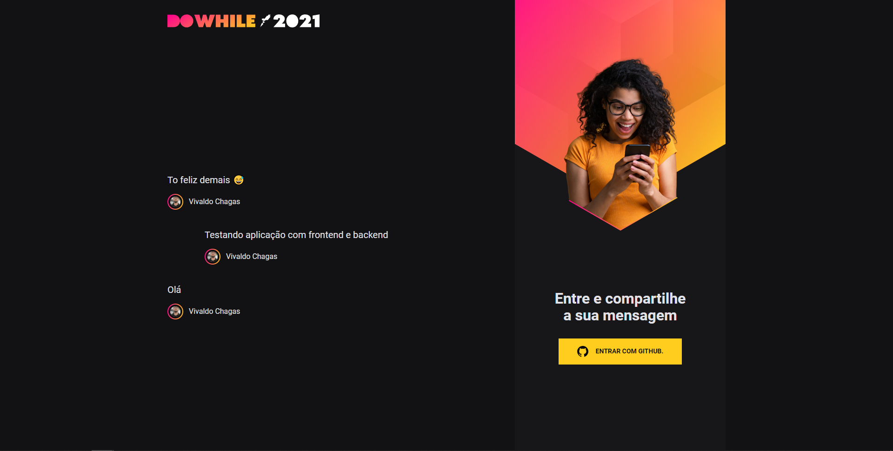

<h1 align="center">👨🏾‍🚀🚀 NLW Heat - Reactjs</h1>

### 🖌️ Aplicação

  

<h2>Detalhes</h2>

- [⚙️ Tecnologias](#️-tecnologias)
- [📖 Projeto](#-projeto)
- [🖌️ Layout](#️-layout)
- [🚀 Features](#-features-de-minha-autoria)

---

A aplicação foi desenvolvida em:

- [Reactjs](https://pt-br.reactjs.org/)
- [TypeScript](https://www.typescriptlang.org/)
- [Sass](https://sass-lang.com/)
- [Socket.IO](https://socket.io/)

---

## 🚀 Como utilizar o projeto

> Usamos no projeto autenticação via OAuth com o GitHub

- Clone o repositório e acesse a pasta;
- Instale as dependências com `yarn`;
- Inicie o servidor com `yarn dev`;

A aplicação pode ser acessada em [`localhost:4000`](http://localhost:4000).

## 📄 O que aprendi na prática e as features que adicionei no projeto

- Como integrar com o Backend;
- Componentes;
- Contexto no React;
- Aprendi a usar Preloader nas páginas 😁;
### Features
- Adicionei um link para o perfil do autor de cada mensagem com algumas features que fiz no Backend da aplicação (https://github.com/Nosferatuvjr/NLW-Heat-Node);
- Aprendi a utilizar um preloader no React e ficou massa;
- Efeitos para o carregamento das imagens;
- Adicionei um tratamento no envio da mensagem. Uma mensagem de confirmação de envio utilizando [react-hot-toast](https://react-hot-toast.com/)

### Obrigado [Rocketseat](https://www.rocketseat.com.br/) e vamos buscar ser 🚀 #Protagonistas

  

